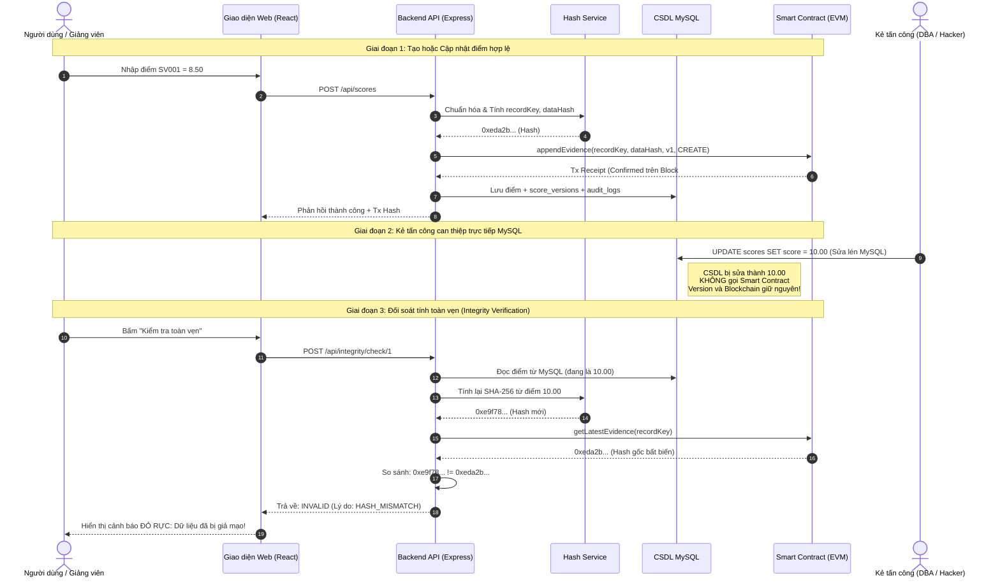

# Kịch Bản Thuyết Trình & Trình Diễn Demo (Presentation Script)

> **Đề tài:** Ứng dụng Blockchain trong kiểm tra tính toàn vẹn cơ sở dữ liệu  
> **Mục tiêu:** Chứng minh hệ thống phát hiện hành vi sửa lén điểm sinh viên trong MySQL thông qua Smart Contract trên Ethereum.

---

## 1. Sơ Đồ Luồng Hoạt Động (Data Flow)



---

## 2. Chuẩn Bị Môi Trường Trước Khi Thuyết Trình

Mở **3 cửa sổ Windows PowerShell**:

### Cửa sổ 1: Chạy Blockchain Node cục bộ
```powershell
npm.cmd run blockchain:node
```
*Để nguyên cửa sổ này chạy ngầm.*

### Cửa sổ 2: Deploy Contract và Chuẩn bị CSDL
```powershell
# 1. Deploy hợp đồng thông minh lên Blockchain local
npm.cmd run blockchain:deploy

# 2. Khởi tạo cấu trúc bảng MySQL, không nạp dữ liệu mẫu
npm.cmd run db:init
```

Với CSDL mới, lệnh trên chỉ tạo các bảng trống, bao gồm bảng tài khoản. Các tài khoản và bản ghi minh họa trong kịch bản bên dưới cần được chuẩn bị riêng trước buổi demo; chúng không tự xuất hiện khi khởi tạo CSDL. Lệnh `db:seed` chỉ dành cho việc chủ động nạp mẫu, không cần chạy khi muốn giữ bảng trống. Khởi tạo cấu trúc không xóa dữ liệu đã có.

### Cửa sổ 3: Khởi động Ứng dụng Full-stack
```powershell
npm.cmd run dev
```
Mở trình duyệt truy cập: **[http://localhost:3000](http://localhost:3000)**

---

## 3. Các Bước Thuyết Trình Trực Tiếp (Từng Bước Kèm Lời Thoại)

### Bước 1: Đăng nhập & Giới thiệu Giao diện
- **Hành động:** 
  1. Trên màn hình đăng nhập, bấm vào nút chọn nhanh **`ADMIN`** (`admin` / `Admin@123`).
  2. Bấm **Đăng Nhập**.
- **Lời thoại gợi ý:**  
  *"Kính thưa Thầy/Cô và Hội đồng, đây là hệ thống bảo vệ toàn vẹn CSDL bằng Blockchain. Hệ thống phân chia 3 vai trò: Admin (toàn quyền), Lecturer (Giảng viên nhập điểm), và Auditor (Kiểm toán viên chỉ xem đối soát). Chúng ta đang đăng nhập dưới vai trò Admin."*

---

### Bước 2: Trình diễn Dashboard & Bằng chứng Blockchain
- **Hành động:**
  1. Xem 4 thẻ thống kê: Tổng bản ghi, VALID (Toàn vẹn), INVALID (Giả mạo), PENDING (Chờ).
  2. Cuộn xuống xem danh sách **"Giao Dịch Blockchain Gần Nhất"** và **"Nhật Ký Kiểm Toán"**.
- **Lời thoại gợi ý:**  
  *"Trên Dashboard, hệ thống giám sát đồng thời kết nối CSDL MySQL và Ethereum Node. Mọi thay đổi điểm số đều sinh ra giao dịch tương ứng với Tx Hash, Block Number bất biến được neo vào Smart Contract `IntegrityRegistry`."*

---

### Bước 3: Tạo và Cập nhật điểm (Append-Only & Ngăn ghi đè)
- **Hành động:**
  1. Chuyển sang tab **"Quản lý Điểm"**.
  2. Bấm **"Thêm Bản Ghi Điểm Mới"**:
     - Mã SV: `SV100`
     - Môn học: `ATWEB`
     - Học kỳ: `2026-1`
     - Điểm số: `8.50`
     - Bấm **"Tạo Bản Ghi & Neo Blockchain"**.
  3. Quan sát bản ghi mới xuất hiện với version `v1` và badge `VALID`.
  4. Bấm nút **"Sửa"** trên dòng `SV100`:
     - Nhập điểm mới: `9.00`
     - Bấm **"Cập Nhật Version Mới"**.
  5. Bấm nút **"👁️ Chi tiết"**:
     - Cho Hội đồng xem **Timeline lịch sử**: Version 1 (8.50, CREATE) và Version 2 (9.00, UPDATE).
- **Lời thoại gợi ý:**  
  *"Khi cập nhật điểm từ 8.50 lên 9.00, Smart Contract không cho phép ghi đè. Hệ thống bắt buộc tăng version lên 2, lưu tiếp một bằng chứng mới. Version 1 vẫn tồn tại nguyên vẹn trên Blockchain, đảm bảo tính minh bạch lịch sử hoàn toàn."*

---

### Bước 4: Trình diễn Kịch bản Tấn công Giả mạo (Cao Trào Demo)
- **Hành động:**
  1. Chuyển sang tab **"⚡ Demo Tấn công"** (hoặc mở Terminal chạy `npm.cmd run demo:tamper`).
  2. Chọn bản ghi: `SV001` (Điểm gốc đang là `8.50`).
  3. Ô "Điểm số sửa lén thành": Nhập `10.00`.
  4. Bấm nút màu đỏ: **"💥 Kích Hoạt Tấn Công (Sửa MySQL)"**.
  5. Hệ thống hiển thị cảnh báo: *Dữ liệu đã bị sửa trực tiếp trong MySQL mà không thông qua Smart Contract*.
  6. Ngay lập tức, màn hình đối soát bật lên **MÀU ĐỎ RỰC**:
     ```text
     KẾT QUẢ ĐỐI SOÁT: INVALID
     Lý do: HASH_MISMATCH
     Thông báo: Dữ liệu trong MySQL đã bị can thiệp trái phép! Hash tính từ CSDL không khớp với Evidence trên Blockchain.
     ```
  7. Chỉ vào bảng so sánh:
     - **Hash CSDL:** `0xe9f78...` (Tính lại từ `SV001|ATWEB|2026-1|10.00|1|ACTIVE`)
     - **Hash Blockchain:** `0xeda2b...` (Bằng chứng lúc tạo điểm `8.50`)
- **Lời thoại gợi ý:**  
  *"Đây là tình huống giả định một DBA biến chất hoặc tin tặc đột nhập vào MySQL và sửa điểm của sinh viên SV001 từ 8.50 thành 10.00. Nếu không có Blockchain, điểm 10.00 này sẽ được chấp nhận là thật. Tuy nhiên, khi Checker chạy, hệ thống tính lại SHA-256 từ MySQL và đối chiếu với Smart Contract. Vì kẻ tấn công không thể sửa được Blockchain, mã băm lập tức bị lệch và hệ thống gắn cờ INVALID: HASH_MISMATCH ngay lập tức!"*

---

### Bước 5: Khôi phục Dữ liệu Hợp lệ
- **Hành động:**
  1. Bấm nút màu xanh: **"🔄 Khôi Phục Lại Dữ Liệu Hợp Lệ"**.
  2. Hệ thống lấy lại giá trị điểm hợp lệ `8.50` từ phiên bản đã được neo trên Blockchain.
  3. Kết quả đối soát lập tức chuyển lại sang **MÀU XANH LÁ (VALID)**:
     ```text
     KẾT QUẢ ĐỐI SOÁT: VALID
     Thông báo: Dữ liệu CSDL khớp hoàn toàn với Bằng chứng toàn vẹn trên Blockchain.
     ```
- **Lời thoại gợi ý:**  
  *"Hệ thống hỗ trợ khôi phục tự động dữ liệu về phiên bản hợp lệ gần nhất đã được Blockchain bảo chứng. Dữ liệu trở về trạng thái toàn vẹn 100%."*

---

### Bước 6: Thử nghiệm Phân quyền (RBAC) với Kiểm toán viên
- **Hành động:**
  1. Trên thanh Header, bấm vào nút **"Kiểm toán"** để đổi tài khoản sang `auditor`.
  2. Quan sát: Nút "Thêm Bản Ghi Điểm", "Sửa", "Xóa" và tab "Demo Tấn công" bị ẩn hoặc từ chối quyền.
  3. Tài khoản Auditor vẫn có toàn quyền vào tab **"Kiểm tra Toàn vẹn"** để bấm **"Chạy Kiểm Tra Toàn Bộ CSDL"** nhằm kiểm toán định kỳ.
- **Lời thoại gợi ý:**  
  *"Hệ thống thiết kế phân quyền chặt chẽ. Kiểm toán viên độc lập chỉ có quyền kiểm tra tính toàn vẹn và xuất báo cáo, không có quyền can thiệp dữ liệu điểm."*

---

## 4. Tóm Tắt Giá Trị Kỹ Thuật Đạt Được

1. **Hiệu năng & Chi phí:** Không ghi điểm rõ lên blockchain, chỉ neo hash 32 bytes (`bytes32`), tiết kiệm 95% gas và bảo vệ quyền riêng tư học tập của sinh viên.
2. **Khách quan & Không thể chối bỏ:** Ngay cả người tạo ra hệ thống cũng không thể sửa lén dữ liệu trên blockchain.
3. **Phát hiện mọi hình thức giả mạo:**
   - Sửa điểm: phát hiện `HASH_MISMATCH`.
   - Sửa lùi version: phát hiện `VERSION_MISMATCH`.
   - Chèn dòng lén không qua chain: phát hiện `MISSING_ON_CHAIN`.
   - Xóa lén bản ghi: phát hiện `ACTION_MISMATCH`.
