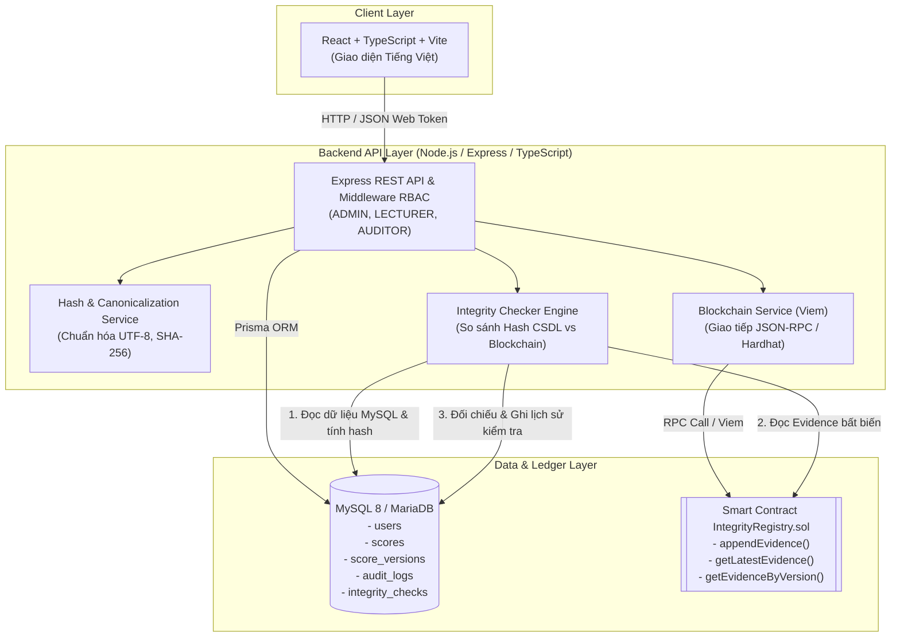

# Ứng Dụng Blockchain Trong Kiểm Tra Tính Toàn Vẹn Cơ Sở Dữ Liệu

> Dự án nghiên cứu và Demo MVP hoàn chỉnh kết hợp Cơ sở dữ liệu quan hệ (MySQL) và Sổ cái phân tán (Ethereum Smart Contract) để phát hiện và ngăn chặn gian lận, can thiệp trái phép vào dữ liệu điểm sinh viên.

---

## 1. Mục Tiêu Đề Tài

Trong các hệ thống quản lý đào tạo và cơ sở dữ liệu truyền thống, quản trị viên cơ sở dữ liệu (DBA), nhân sự nội bộ có quyền root hoặc kẻ tấn công chiếm quyền máy chủ MySQL đều có thể trực tiếp sửa điểm trong cơ sở dữ liệu mà không thông qua ứng dụng nghiệp vụ. Cơ chế trigger hoặc log truyền thống vẫn nằm trong phạm vi kiểm soát của hệ thống máy chủ và có thể bị xóa hoặc vô hiệu hóa.

Đề tài này nghiên cứu và triển khai mô hình **Hybrid Storage (Lưu trữ kết hợp)**:
1. **Toàn bộ dữ liệu nghiệp vụ chi tiết** (thông tin sinh viên, môn học, học kỳ, điểm số, lịch sử) được lưu trữ và truy vấn hiệu năng cao trong **MySQL**.
2. **Bằng chứng toàn vẹn mật mã (Cryptographic Evidence)** của mỗi phiên bản dữ liệu được neo (anchor) bất biến lên **Smart Contract** trên mạng Blockchain (EVM).
3. **Bộ kiểm tra toàn vẹn (Integrity Checker)** tính toán lại mã băm chuẩn hóa (Canonical Hash) độc lập từ MySQL và đối chiếu với Blockchain:
   - Nếu dữ liệu trong MySQL bị can thiệp trực tiếp mà không thông qua Blockchain, hệ thống lập tức phát hiện sai lệch và cảnh báo **`INVALID` (HASH_MISMATCH)**.
   - Bảo toàn lịch sử các phiên bản trước theo mô hình Append-Only, chứng minh dữ liệu cũ không bị ghi đè.

---

## 2. Kiến Trúc Hệ Thống



---

## 3. Vai Trò Của MySQL Và Blockchain

| Tiêu Chí | Cơ Sở Dữ Liệu MySQL | Smart Contract Blockchain |
| :--- | :--- | :--- |
| **Dữ liệu lưu trữ** | Toàn bộ dữ liệu nghiệp vụ: họ tên, mã môn, học kỳ, điểm số, lịch sử phiên bản, nhật ký kiểm toán. | **Chỉ lưu Bằng chứng mật mã**: `recordKey`, `dataHash`, `actorHash`, `version`, `timestamp`, `action`, `writerAddress`. |
| **Tính riêng tư** | Bảo mật thông tin cá nhân và điểm số học tập của sinh viên. | Không lưu bất kỳ văn bản rõ (plaintext) nào, đảm bảo quyền riêng tư. |
| **Tốc độ truy vấn** | Truy vấn cực nhanh, tìm kiếm, phân trang, lọc theo nhiều tiêu chí. | Tốn phí gas khi ghi, không tối ưu cho tìm kiếm chuỗi phức tạp. |
| **Tính bất biến** | Có thể bị can thiệp bởi DBA hoặc tài khoản root máy chủ. | **Tuyệt đối bất biến**, không ai có thể sửa hoặc xóa dữ liệu đã ghi lên block. |

---

## 4. Cấu Trúc Thư Mục Dự Án

```text
blockchain-db-integrity-gravity/
├── contracts/                     # Hợp đồng thông minh Solidity
│   ├── Counter.sol
│   ├── Counter.t.sol
│   └── IntegrityRegistry.sol      # Smart Contract lưu trữ bằng chứng toàn vẹn
├── ignition/modules/              # Hardhat Ignition deployment modules
│   └── IntegrityRegistry.ts
├── test/                          # Kiểm thử hợp đồng thông minh (Viem + node:test)
│   ├── Counter.ts
│   └── IntegrityRegistry.ts       # 13 contract tests (100% PASS)
├── packages/
│   └── shared/                    # Package dùng chung
│       ├── src/
│       │   ├── hash.ts            # Chuẩn hóa (Canonicalization) & SHA-256 Hash
│       │   ├── types.ts           # Kiểu dữ liệu TypeScript & Zod schemas
│       │   ├── abi.ts             # ABI của IntegrityRegistry
│       │   └── index.ts
│       └── test/
│           └── hash.test.ts       # Unit tests cho Hash Service
├── database/
│   ├── migrations/
│   │   └── 001_init.sql           # Schema SQL thuần tạo 5 bảng
│   └── seed/
│       └── seed.ts                # Dữ liệu khởi tạo tài khoản & điểm mẫu
├── prisma/
│   └── schema.prisma              # Định nghĩa Prisma ORM cho MySQL
├── apps/
│   ├── api/                       # Backend REST API (Express + TypeScript)
│   │   ├── src/
│   │   │   ├── blockchain.ts      # Kết nối Viem & Smart Contract
│   │   │   ├── config.ts          # Nạp cấu hình môi trường .env
│   │   │   ├── db.ts              # Prisma Client
│   │   │   ├── middlewares/       # Xác thực JWT & Phân quyền RBAC
│   │   │   ├── services/          # Nghiệp vụ điểm, toàn vẹn, demo
│   │   │   ├── routes/            # Các endpoint API
│   │   │   ├── app.ts
│   │   │   └── index.ts
│   │   └── test/
│   │       └── api.test.ts        # Integration tests API & Checker
│   └── web/                       # Giao diện người dùng (React + Vite + TS)
│       ├── src/
│       │   ├── components/        # Dashboard, ScoreList, Modals, AttackDemo
│       │   ├── App.tsx
│       │   ├── api.ts
│       │   └── index.css
│       └── vite.config.ts
├── scripts/
│   ├── deploy-and-sync-config.ts  # Deploy contract & đồng bộ vào .env
│   ├── tamper-database.ts         # Script demo giả mạo điểm trong MySQL
│   ├── restore-database.ts        # Script khôi phục điểm hợp lệ
│   └── check-integrity.ts         # CLI kiểm tra toàn vẹn trực tiếp
├── .env.example                   # Mẫu cấu hình môi trường
├── README.md                      # Tài liệu tổng quan dự án
└── DEMO.md                        # Kịch bản thuyết trình và hướng dẫn demo
```

---

## 5. Quy Chuẩn Mã Băm Mật Mã (Hash Canonicalization)

Để đảm bảo tính nhất quán tuyệt đối giữa CSDL, Blockchain, Backend và Frontend, module `@integrity/shared` quy định chuỗi định dạng chuẩn (Canonical String) độc lập với hệ điều hành và locale:

1. **Chuỗi định danh bản ghi (`recordKey`):**
   ```text
   input:      studentId|courseCode|semester
   recordKey = SHA256(studentId|courseCode|semester)
   Ví dụ:     SHA256("SV001|ATWEB|2026-1")
   ```

2. **Chuỗi nội dung phiên bản dữ liệu (`dataHash`):**
   ```text
   input:     studentId|courseCode|semester|score|version|status
   dataHash = SHA256(studentId|courseCode|semester|score|version|status)
   Ví dụ v1:  SHA256("SV001|ATWEB|2026-1|8.50|1|ACTIVE")
   Ví dụ v2:  SHA256("SV001|ATWEB|2026-1|9.00|2|ACTIVE")
   ```

3. **Chuỗi định danh người thực hiện (`actorHash`):**
   ```text
   actorHash = SHA256(actorId)
   Ví dụ:     SHA256("lecturer")
   ```

*Quy tắc chuẩn hóa:*
- Cắt khoảng trắng đầu cuối (trim).
- Điểm số (`score`) luôn định dạng **đúng 2 chữ số thập phân** (ví dụ: `8.5` ➔ `"8.50"`, `9` ➔ `"9.00"`, `10` ➔ `"10.00"`).
- `version` là số nguyên dương tăng liên tục (1, 2, 3...).
- `status` viết hoa: `"ACTIVE"`, `"DELETED"`.
- Mã hóa chuỗi UTF-8 trước khi đưa vào SHA-256, kết quả trả về chuỗi Hex tiền tố `0x`.

---

## 6. Yêu Cầu Cài Đặt & Cấu Hình Môi Trường

### 6.1. Yêu cầu hệ thống
- **Hệ điều hành:** Windows 10/11 (sử dụng PowerShell).
- **Node.js:** v20 trở lên (khuyến nghị v22 hoặc v24).
- **MySQL:** MySQL 8.x hoặc MariaDB 10.4+ (có sẵn qua XAMPP hoặc cài độc lập).

### 6.2. Cấu hình MySQL
Tạo cơ sở dữ liệu `blockchain_db_integrity` trên MySQL (port 3306):
```sql
CREATE DATABASE IF NOT EXISTS blockchain_db_integrity CHARACTER SET utf8mb4 COLLATE utf8mb4_unicode_ci;
```

### 6.3. Cấu hình file `.env`
Sao chép `.env.example` thành `.env`:
```powershell
Copy-Item .env.example .env
```
Nội dung mẫu của file `.env`:
```env
DATABASE_URL="mysql://root:@localhost:3306/blockchain_db_integrity"
PORT=4000
JWT_SECRET="demo-blockchain-db-integrity-jwt-secret-key-2026"
BLOCKCHAIN_RPC_URL="http://127.0.0.1:8545"
CONTRACT_ADDRESS="0x5FbDB2315678afecb367f032d93F642f64180aa3"
DEPLOYER_PRIVATE_KEY="0xac0974bec39a17e36ba4a6b4d238ff944bacb478cbed5efcae784d7bf4f2ff80"
ENABLE_DEMO_ATTACKS=true
NODE_ENV=development
```

---

## 7. Hướng Dẫn Chạy Hệ Thống Bằng Windows PowerShell

Mở các cửa sổ **Windows PowerShell** độc lập theo thứ tự:

### Bước 1: Khởi động MySQL Server
Đảm bảo MySQL đang chạy (ví dụ qua XAMPP Control Panel hoặc batch file):
```powershell
C:\xampp\mysql_start.bat
```

### Bước 2: Khởi tạo cấu trúc CSDL (không thêm dữ liệu mẫu)
```powershell
# Tạo các bảng theo prisma/schema.prisma
npm.cmd run db:init
```

Với cơ sở dữ liệu mới, tất cả bảng đều trống, kể cả bảng tài khoản. Lệnh này không nạp sinh viên, lớp học phần, điểm, thông báo hoặc ghi bằng chứng lên blockchain. Nếu CSDL đã có dữ liệu, lệnh không dùng để xóa trắng dữ liệu đó; không chấp nhận yêu cầu mất dữ liệu khi đồng bộ cấu trúc nếu chưa có bản sao lưu.

`db:migrate` vẫn là tên lệnh tương đương để đồng bộ cấu trúc. `db:seed` là thao tác nạp dữ liệu demo riêng, **không thuộc quy trình khởi tạo bảng trống**. Không chạy lệnh seed nếu muốn tự nhập dữ liệu. Các tài khoản demo bên dưới chỉ tồn tại khi đã nạp mẫu; CSDL trống cần được cấp tài khoản trước khi đăng nhập.

### Bước 3: Khởi động Blockchain Local Node
Mở **Terminal 1**:
```powershell
npm.cmd run blockchain:node
```
*Lệnh này sẽ khởi chạy một Ethereum RPC Node cục bộ tại `http://127.0.0.1:8545` và cung cấp 20 ví thử nghiệm có sẵn ETH.*

### Bước 4: Deploy Smart Contract
Mở **Terminal 2**:
```powershell
npm.cmd run blockchain:deploy
```
*Script sẽ tự động biên dịch hợp đồng, deploy `IntegrityRegistry` lên local node, lấy địa chỉ và tự động cập nhật vào file `.env`.*

### Bước 5: Chạy Backend API & Frontend Web
Mở **Terminal 3**:
```powershell
# Chạy đồng thời cả API (port 4000) và Web (port 3000):
npm.cmd run dev
```
Hoặc chạy riêng từng dịch vụ:
- Backend API: `npm.cmd run dev:api` (http://localhost:4000)
- Frontend Web: `npm.cmd run dev:web` (http://localhost:3000)

Truy cập trình duyệt: **[http://localhost:3000](http://localhost:3000)**

---

## 8. Tài Khoản Demo Mẫu

Hệ thống cung cấp sẵn 3 tài khoản tương ứng với 3 vai trò phân quyền (RBAC):

| Vai Trò | Tên Đăng Nhập | Mật Khẩu | Quyền Hạn |
| :--- | :--- | :--- | :--- |
| **ADMIN** | `admin` | `Admin@123` | Toàn quyền: Xem, thêm, sửa, soft-delete, kiểm tra toàn vẹn, mô phỏng tấn công giả mạo & khôi phục. |
| **LECTURER** | `lecturer` | `Lecturer@123` | Giảng viên: Tạo điểm mới, cập nhật điểm, soft-delete điểm môn phụ trách. |
| **AUDITOR** | `auditor` | `Auditor@123` | Kiểm toán viên: **Chỉ xem** và chạy đối soát kiểm tra toàn vẹn (không được sửa điểm). |

*(Giao diện Web có sẵn thanh chọn nhanh tài khoản giúp chuyển đổi vai trò chỉ trong 1 click).*

---

## 9. Chạy Kiểm Thử (Tests) & Build

Chạy toàn bộ test suites trong 1 lệnh duy nhất:
```powershell
npm.cmd run test
```
Bao gồm:
- **Contract tests:** 13 tests kiểm tra logic append-only, tính liên tục của version, ngăn chặn xóa đè, kiểm tra quyền owner.
- **Unit tests:** 4 tests kiểm tra Hash Service và chuẩn hóa dữ liệu Canonicalization.
- **Backend API tests:** 9 integration tests kiểm tra xác thực JWT, phân quyền RBAC, vòng đời CREATE/UPDATE/DELETE, kiểm tra toàn vẹn VALID, phát hiện giả mạo INVALID (HASH_MISMATCH) và khôi phục.

Kiểm tra biên dịch production toàn dự án:
```powershell
npm.cmd run build
```
